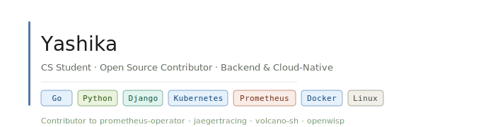

---

### About

CS student focused on backend systems, Kubernetes controllers, and cloud-native infrastructure. Active contributor across multiple CNCF projects including prometheus-operator, Jaeger, and Volcano.

Currently preparing for **GSoC** and **LFX Mentorship** with the Python Software Foundation and Django ecosystem.

---

### Contributions

**[prometheus-operator/prometheus-operator](https://github.com/prometheus-operator/prometheus-operator)**

| PR | Title | Size |
|----|-------|------|
| [#8358](https://github.com/prometheus-operator/prometheus-operator/pull/8358) | fix(thanos): update config resource status on initial ThanosRuler reconcile | S |
| [#8356](https://github.com/prometheus-operator/prometheus-operator/pull/8356) | Fix incorrect availability status aggregation in sharded Prometheus | L |
| [#8347](https://github.com/prometheus-operator/prometheus-operator/pull/8347) | fix: compute input hash before creating ThanosRuler StatefulSet | S |
| [#8330](https://github.com/prometheus-operator/prometheus-operator/pull/8330) | Fix nil pointer panic in OnUpdate event handler | XS |
| [#8323](https://github.com/prometheus-operator/prometheus-operator/pull/8323) | Fix race condition in finalizer removal using JSON Patch test operation | S |
| [#8309](https://github.com/prometheus-operator/prometheus-operator/pull/8309) | Fix: Prevent StatefulSet recreate deadlock after immutable field updates | L |

**[jaegertracing/jaeger](https://github.com/jaegertracing/jaeger)**

| PR | Title |
|----|-------|
| [#7940](https://github.com/jaegertracing/jaeger/pull/7940) | fix: Ensure Badger maintenance is stopped before existing Close() |

**[volcano-sh/volcano](https://github.com/volcano-sh/volcano)**

| PR | Title |
|----|-------|
| [#5002](https://github.com/volcano-sh/volcano/pull/5002) | fix(cache): validate PodGroup before eviction to prevent cache inconsistency |

---

### Currently Active

**[openwisp/openwisp-controller](https://github.com/openwisp/openwisp-controller)** — Django-based network controller. Actively contributing as part of GSoC 2026 preparation.

---

### Stack

**Languages:** Go &nbsp;·&nbsp; Python

**Frameworks:** Django

**Infrastructure:** Kubernetes &nbsp;·&nbsp; Prometheus &nbsp;·&nbsp; Docker &nbsp;·&nbsp; Linux
